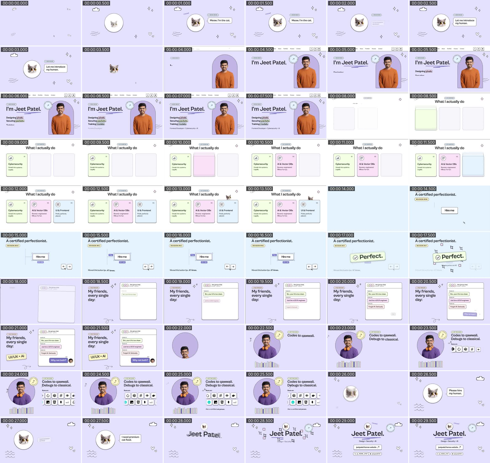

# Jeet — "about me" video

A 30-second animated portfolio video about Jeet: what Jeet does, the personality and the tech stack. It's styled exactly like the portfolio at **https://jeetpatel.framer.website/** and hosted by the cat in sunglasses.

**Watch:** [`out/jeet-patel-portfolio.mp4`](out/jeet-patel-portfolio.mp4) (1920×1080, 60 fps, H.264 + AAC 320k, −14 LUFS). [`out/contact-sheet.jpg`](out/contact-sheet.jpg) shows one frame every 0.5 s.



## How it's made

Everything is generated from code. No stock footage, no samples, no editing app.

| Part | Where | What it does |
|---|---|---|
| Timing | `video/cues.json` | One timeline shared by picture and sound (120 BPM: beat = 0.5 s, bar = 2 s) |
| Animation | `video/index.html`, `style.css`, `main.js` | HTML/CSS scenes animated with one paused GSAP timeline. `window.__seek(t)` renders any instant, so every frame is reproducible |
| Soundtrack | `audio/soundtrack.py` | Synthesised in NumPy/SciPy: tanpura drone, harmonium, bansuri with meend, dholak and tabla in kehrwa, a qawwali taali crowd, ghungroo, sub kick and bass, synced SFX, and two formant-synthesised meows. Ends with a tihai landing on sam. Mastered to −14 LUFS / −1.2 dBTP |
| Renderer | `render/render.mjs` | Playwright drives Chromium frame by frame. Adaptive motion blur measures how far elements move during a 180° shutter and averages up to 32 sub-frames where needed |
| Pipeline | `render/build.sh` | Soundtrack, then frames, then MP4 (BT.709), then contact sheet |

### Scenes
1. **0–4 s:** the cat introduces itself ("Let me introduce my human."), then zooms in; its silhouette opens onto Jeet's photo.
2. **4–8 s:** the portfolio hero, recreated: "Designing pixels. Securing packets. Training models.", one phrase per beat.
3. **8–14 s:** three expertise cards slam into Figma-style slots. The cat peeks over the last one.
4. **14–18 s:** the perfectionist gag: a button nudged 1px, 47 revisions, "Perfect." *(it was perfect at #1)*.
5. **18–22 s:** the group chat says "Just be a UI/UX engineer." Jeet replies "Why not both?" A **UI/UX × AI** sticker lands.
6. **22–26 s:** "Codes to qawwali. Debugs to classical." with an equaliser driven by the actual soundtrack and the stack scrolling by (with a cat).
7. **26–30 s:** the cat asks you to hire its human (it needs premium cat food). The end card lands on the final beat.

### Build it

```bash
npm install                      # GSAP, Playwright 1.56.1, pngjs
pip install -r requirements.txt  # numpy, scipy
bash render/build.sh             # ~10 min on 4 cores, writes out/
```

To inspect single frames: `node render/render.mjs --stills 4.5,17.2` (after the soundtrack step has written `build/levels.json`).

---

# Assets

## The vibe (rules for every scene)

Soft, friendly, hand-drawn "neo-brutalist light". Sections on the site alternate **lavender** and **white**, separated by a 2px ink line.

- **Outlines everywhere:** 2px `#1D1D1D` border on cards, buttons, pills, photo frames and icon circles. No drop shadows or gradients.
- **Stacked buttons:** every button sits on a second outlined layer that peeks out 6px underneath (`.btn` in `theme.css`).
- **Pastel cards:** each card, tag or pill gets one pastel fill (mint, pink, sky, peach, butter) with radius 20px.
- **Pills:** small uppercase DM Sans 900 tags with an asterisk ✳ ("✳ MEOW MEOW").
- **One accent colour:** purple `#7575C8`, used for the hand-drawn scribble under the name and active states. Use it sparingly.
- **Doodles:** black line sparkles, wavy lines, hearts, a curly arrow, clouds and an envelope float around the edges of each scene.
- **Signature pieces:** Jeet framed in an **arch** (round top, square bottom) on a lilac backdrop; a **rotating circular badge** ("I AM AVAILABLE FOR FREELANCE"); the **cat in sunglasses** logo.
- **Humour already on the site:** "MEOW MEOW", "secure by hope", "Designing pixels. Securing packets. Training models."

## Palette

| Token | Hex | Use |
|---|---|---|
| `--lavender` | `#E3E3FF` | main background |
| `--white` | `#FFFFFF` | alternate background, button face |
| `--ink` | `#1D1D1D` | all text, outlines, doodles |
| `--purple` | `#7575C8` | accent (underline scribble, highlights) |
| `--photo-lavender` | `#C4B8E7` | backdrop behind Jeet in the arch |
| `--mint` | `#F3FFE3` | card |
| `--pink` | `#FDE4F9` | card |
| `--sky` | `#E3F2FF` | card, pill, badge |
| `--peach` | `#FFEEEB` | card |
| `--butter` | `#FFF5C9` | card |
| `--grey` | `#888888` | small labels |

All tokens and ready-made `.btn`, `.pill`, `.card` and `.icon-circle` styles are in [`assets/theme.css`](assets/theme.css).

## Fonts

| Font | Used for | File |
|---|---|---|
| **Cabinet Grotesk** 700 | headings, card titles, nav | run `assets/fonts/get-cabinet-grotesk.sh` (see note) |
| **DM Sans** 400 / 600 / 900 | body 400, buttons 600, uppercase tags 900 | `assets/fonts/DMSans-Variable.ttf` |
| **Inter** 600 | the "Jeet" wordmark next to the cat | `assets/fonts/Inter-Variable.ttf` |
| **Fragment Mono** | terminal / code jokes | `assets/fonts/FragmentMono-Regular.ttf` |

Cabinet Grotesk is free to use in videos, but its ITF Free Font License forbids putting the font files in a public repo. The script downloads it from Fontshare into `assets/fonts/cabinet-grotesk/`, which is git-ignored. The other three fonts are SIL OFL, and their licenses are included.

## What's in `assets/`

| Folder | Contents |
|---|---|
| `images/` | `jeet-cutout-orange-sweater.png` and `jeet-cutout-headphones.png` (**transparent background**), the original photos, the cat logo, and the site's share image |
| `doodles/` | 20 SVG doodles taken from the site: sparkles, waves, hearts, curly arrow, squiggle, clouds, envelope, lightning, underline scribble, both rotating badge rings and their arrow |
| `icons/` | service icons (full-stack, cybersecurity, AI, reverse engineering), process icons, arrow buttons, socials (X, GitHub, LinkedIn, Dribbble, Instagram) |
| `tech-logos/mono/` | 32 single-colour logos for the stack from the GitHub README and the site's tools marquee (recolour to `#1D1D1D`) |
| `tech-logos/color/` | 27 full-colour versions of the same logos, where available |
| `reference/` | screenshots of the live portfolio (desktop and mobile, hero and full page) |
| `style-board.html` / `.png` | everything above on one page, rendered with `theme.css` |

## Credits

- Photos, logo, doodles and icons are from Jeet's own portfolio. The cut-outs were made with `rembg` (BiRefNet portrait model).
- Mono tech logos are from [Simple Icons](https://simpleicons.org) (CC0). Colour logos are from [Devicon](https://devicon.dev) (MIT). Brand logos remain trademarks of their owners.
- Fonts: DM Sans, Inter and Fragment Mono are SIL OFL 1.1. Cabinet Grotesk is from Indian Type Foundry / Fontshare under the ITF FFL.
